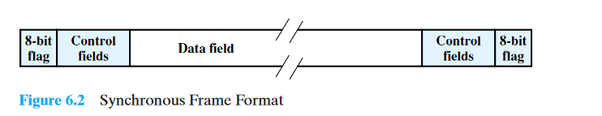

# Transmissão síncrona e assíncrona

> Transmissão de Dados
>
>Professor De. Emanuel B. Rodrigues

- [Introdução](#introdu%c3%a7%c3%a3o)
  - [Ideia chave](#ideia-chave)
- [Técnicas de Transmissão](#t%c3%a9cnicas-de-transmiss%c3%a3o)
  - [Exemplificação](#exemplifica%c3%a7%c3%a3o)
- [Transmissão Assíncrona](#transmiss%c3%a3o-ass%c3%adncrona)
  - [(a) Formato de caractere](#a-formato-de-caractere)
  - [(b) Fluxo assíncrono de caracteres de 8 bits](#b-fluxo-ass%c3%adncrono-de-caracteres-de-8-bits)
  - [(c) Efeito de erro no *timing*](#c-efeito-de-erro-no-timing)
  - [Tranmissão Assíncrona: Conclusão](#tranmiss%c3%a3o-ass%c3%adncrona-conclus%c3%a3o)
- [Transmissão Síncrona](#transmiss%c3%a3o-s%c3%adncrona)
- [Imagens Resumo](#imagens-resumo)
- [Bibliografia](#bibliografia)

## Equipe

- Marcos Davy
- Wesley Carneiro
- Matthews Jones
- Marcos Martin
- Matheus Guimarães

## Introdução

> A conversation forms a two-way communication link; there is a measure of symmetry between the two parties, and messages pass to and fro. There is a continual stimulus-response, cyclic action; remarks call up other remarks, and the behavior of the two individuals becomes concerted, co-operative, and directed toward some goal.
> This is true communication.”
>
> —On Human Communication, Colin Cherry

### Ideia chave

- A transmissão de um fluxo de bits de um dispositivo para outro através de um link de transmissão envolve muita cooperação e acordo entre os dois lados;
- Um dos requisitos mais fundamentais é a sincronização. O receptor deve saber a taxa na qual os bits estão sendo recebidos, para que possa amostrar a linha em intervalos apropriados para determinar o valor de cada bit recebido;
- Duas técnicas são comumente usadas para este propósito;
- Em uma __transmissão assíncrona__, cada caractere da informação é tratado independentemente;
- Cada  caractere começa com um bit inicial que alerta o receptor de que um caractere está chegando. O receptor faz a amostragem de cada bit no caractere e depois procura o início do próximo caractere;
- Esta técnica não funciona bem para longos blocos de dados porque o clock do receptor pode eventualmente sair da sincronização;
- Enviar dados em grandes blocos é mais eficiente que enviar dados em um único caractere por vez;
- Para **grandes blocos**, a **transmissão síncrona** é utilizada;
Cada bloco de informação é formatado como um frame que inclui uma flag inicial e final;
- É utilizada alguma forma de sincronização, como o uso da codificação *Manchester*.

Nas últimas apresentações, vimos um foco primário na preocupação com os **atributos de transmissão** de dados, como as **características dos sinais** de dados e meios de comunicação, a **codificação** de sinais e o **desempenho** da transmissão.

Nesta apresentação, mudamos nossa ênfase da transmissão de dados para a **comunicação de dados**.

## Técnicas de Transmissão

- Principal preocupação: **transmissão serial de dados**.
  - Os dados são transmitidos por um único caminho de sinal, em vez de um conjunto paralelo de linhas, o que é comum com dispositivos I/O (in/out, entrada/saída).
- Em transmissão serial, os elementos do sinal são enviados um de cada vez, e cada elemento pode ser do tipo:
  - **Menos de um bit**: por exemplo, é o caso da Codificação Manchester.
  - **Um bit**: NRZ-L (exemplo digital) e FSK (exemplo analógico).
  - **Mais de um bit**: QPSK.
  - Simplificando, a seguir nós assumiremos um bit por sinal por padrão a não ser que seja indicado.

> Efeito de Ruído em um Sinal Digital
>
> Figure 3.16, taken from "Data and Computer Communications, 8ª edition" by William Stallings

- A recepção dos dados digitais envolve amostragem do sinal recebido uma vez por tempo de bit para determinar o valor binário.
- Uma das dificuldades encontradas nesse processo é que várias deficiências de transmissão corromperão o sinal.
  - Esse problema é agravado por uma dificuldade de temporização:
    - Para que o receptor experimente os bits da entrada corretamente, ele deve saber a hora de chegada e a duração de cada bit que recebe.

### Exemplificação

- O remetente transmite um fluxo de bits de **dados**.
- O remetente possui um clock que comanda o tempo dos bits transmitidos.
- Por exemplo:
  - 1Mbps de **velocidade** de transmissão.
  - Um bit transmitido a cada **microsegundo**, conforme medido pelo clock do remetente.
  - Normalmente, o receptor tentará amostrar o meio no centro de cada bit de tempo.
  - O receptor cronometrará suas amostras em intervalos de **um bit**.
  - Se o receptor cronometrar de acordo com o seu clock, haverão problemas se o clock do remetente não estiver alinhado com precisão.
  - Após 50 ou mais amostras o receptor pode estar com erro pois está amostrando com o tempo de bit errado.
  - Eventualmente, dependendo do tamanho do deslocamento, o receptor estaria fora de sincronia com o transmissor.
  - Se o clock do receptor for 1% mais rápido ou mais lento que o clock do remetente, a primeira amostragem será a de 0,01 de um bit de tempo longe do centro (ou seja, o centro do bit estará deslocado).

## Transmissão Assíncrona

Existem duas abordagens comuns para alcançar a transmissão desejada: Uma delas é a transmissão assíncrona. Suas características são:

- Evita o problema de temporização por não enviar fluxos de bits longos e ininterruptos;
- Dados são transmitidos um caractere de cada vez, onde cada sinal tem de cinco a oito bits de comprimento;
- O tempo ou a sincronização precisa ser mantido apenas dentro de cada sinal, o receptor tem a oportunidade de ressincronizar no início de cada novo sinal;

> Técnicas de Codigicação de Sinal
>
> Figure taken from "Data and Computer Communications, 8ª edition" by William Stallings

- **Non-return-to-zero level (NRZ-L)** é um código binário no qual os ‘uns (1)’ são representados por uma voltagem negativa, enquanto os ‘zeros (0)’ são representados por voltagem positiva, sem condição de repouso.

> (a) Formato de caractere
>
> (b) Fluxo assíncrono de caracteres de 8 bits
>
> (c) Efeito de erro no *timing*
>
> Figure taken from "Data and Computer Communications, 8ª edition" by William Stallings

### (a) Formato de caractere

1. O **estado ocioso** é o equivalente ao sinal transmitido na linha permanecer com valor ‘um (1)’. Por isso é utilizado NRZ-L, onde sinal ocioso será a presença do valor de faixa negativo da linha de transmissão;
2. O começo de um caractere é sinalizado por um **bit inicial** com o valor ‘zero (0)’, então é seguido por 5 a 8 bits que fazem o caractere, definidos pela convenção de código usada;
3. Os bits do caractere são transmitidos começando com o bit menos significativo;
4. O **bit de paridade** é atribuído para o transmissor de modo que o número total de ‘uns (1)’ que está no mesmo caractere, incluindo o bit de paridade, é ímpar ou par, dependendo da convenção usada, o receptor irá usá-lo para a detecção de erro;
5. O último elemento é o **elemento de parada**, que é o retorno do valor ‘1’ no sinal de transmissão. Um comprimento mínimo para o **elemento de parada** é então especificado, e é frequentemente um, um e meio ou duas vezes a duração que um bit ordinário demora a ser enviado. Nota-se que nenhum valor máximo é especificado (devido ao sinal ser assíncrono);
6. Por o elemento de parada ser o mesmo do estado ocioso (valor ‘1’ na linha de transmissão), o transmissor irá continuar transmitindo o elemento de parada até estar pronto para enviar o próximo sinal;

### (b) Fluxo assíncrono de caracteres de 8 bits

- Os requisitos de tempo para esse esquema de transmissão são mais modestos. Por exemplo, os caracteres IRA¹ geralmente são enviados como unidades de 8 bits, incluindo o bit de paridade. 
- Se o receptor for 5% mais lento ou mais rápido que o transmissor, a amostra do oitavo bit do sinal será deslocada em 45% e ainda será registrada corretamente. Porém, isso pode ocasionar alguns erros.

### (c) Efeito de erro no *timing*

- Taxa de dados de 10,000 bits por segundo (10 kbps). Cada bit possui 0.1 milisegundos (ms), ou 100μs de duração;
- O receptor é 6% (seis por cento) mais rápido que o transmissor, com isso, o receptor coleta os caracteres a cada 94μs;

Um erro como o descrito na verdade resulta em dois erros:

1. Primeiro, a última amostra de bit foi recebida incorretamente.
1. Segundo, a contagem de bits agora pode estar desalinhada. Se o bit 7 for ‘1’ e o bit 8 for ‘0’, o bit 8 poderá ser confundido com o bit inicial.

Essa condição é denominada ‘erro de enquadramento’, pois o sinal, o bit inicial até o elemento de parada são chamados de enquadramento. Um erro de enquadramento também pode ocorrer se alguma condição de ruído causa a aparência falsa de um bit de início durante o estado ocioso.

### Tranmissão Assíncrona: Conclusão

A transmissão assíncrona é simples e barata, mas requer uma sobrecarga de dois a três bits para cada sinal.

Por exemplo: Para um sinal de 8 bits sem bit de paridade, usando um elemento de parada de 1 bit, dois de dez bits não transmitem informações, porém existem apenas para sincronização; assim, a sobrecarga é de 20%. 

Naturalmente, a porcentagem de sobrecarga pode ser reduzida enviando blocos maiores de bits entre o bit inicial e o elemento de parada. No entanto, como a última figura indica, quanto maior o bloco de bits, maior o erro de tempo acumulado.

## Transmissão Síncrona

A segunda abordagem é a transmissão síncrona:

- Transmissão mais rápida;
- Necessita de um sinal de clock em comum, ou de um jeito de compartilhar;
- Pode demorar um pouco para começar a enviar dados;

Alguns exemplos de comunicação síncrona:

- Videoconferências
- Conversas telefônicas
- Aplicativos de mensagem instantânea

Existem duas técnicas para sincronização do clock:

- Usar pulsos de clock de um dos extremos (transmissor ou receptor)
  - Funciona bem em pequenas distâncias, mas em grandes distâncias está sujeita às mesmas questões dos sinais de dados
- Embutir a informação do clock nos sinais de dados
  - Sinais digitais: Manchester ou differential Manchester 
  - Sinais analógicos: técnicas variadas. Por exemplo, usar a frequência da onda portadora para sincronizar o receptor baseado na fase da onda.

Existe outro nível de sincronização necessária, para que o receptor consiga determinar o começo e o final de um bloco de dados:

- Adicionar uma indicação antes e depois do bloco de dados
- O bloco de dados, somado aos bits de indicação e os bits de controle, formam um frame.

> Figura 6.2: Formato de Frame Síncrono
>
> Figure taken from "Data and Computer Communications, 8ª edition" by William Stallings

- Para grandes blocos de dados, a transmissão síncrona se torna muito mais eficiente que a transmissão assíncrona. 
  - A transmissão assíncrona requer um overhead de mais de 20% dos bits totais;
  - O conjunto de overhead em uma transmissão síncrona, os dois bytes de início e fim e os bits de controle, tipicamente não passam de 100 bits.

## Imagens Resumo

> Métodos de Comunicação: Tipos de transmissão

> Métodos de Comunicação: Transmissão assíncrona

> Métodos de Comunicação: Transmissão síncrona X Transmissão assíncrona

## Bibliografia

- STALLINGS, William. **Data and Computer Communications.** 8. ed. New Jersey: Pearson Education, 2007. 892 p.

